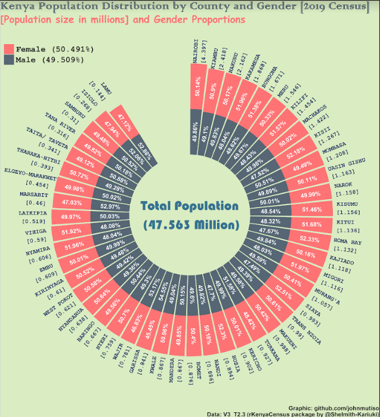
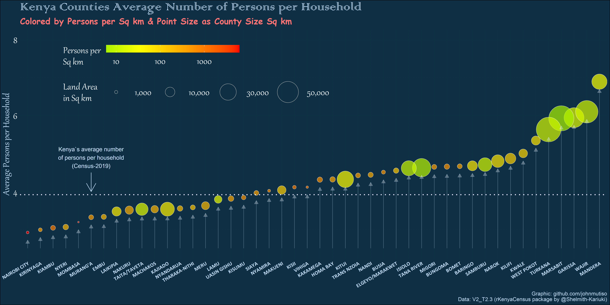

```{r, echo=FALSE}
knitr::opts_chunk$set(comment = "#>",
                      fig.path = "figs/",
                      collapse = TRUE,message=FALSE, 
                      warning=FALSE,fig.height=6,fig.width = 12)
options(scipen = 999)
```

```{r, echo=FALSE}

library(rKenyaCensus)
library(tidyverse)
library(ggthemes)
library(patchwork)

## My theme

my_theme <- theme_hc()+theme(plot.title = element_text(face = "bold", hjust = 0.5, size = 16),
                       axis.text = element_text(face = 12,size = 12),
                       axis.title = element_text(face = "italic",size = 14),
                       axis.line = element_line(size = 1.5),
                       plot.subtitle = element_text(hjust = 0.5, size = 14),
                       plot.caption = element_text(face = "bold", size = 12),
                       panel.background = element_rect(fill = NA))


KNBS_brown <- "#B06444"
```


[rKenyaCensus](https://github.com/Shelmith-Kariuki/rKenyaCensus) is an R package that contains the 2019 Kenya Population and Housing Census results. The results were released by the [Kenya National Bureau of Statistics](https://twitter.com/KNBStats) in February 2020, and published in four different pdf files (Volume 1 - Volume 4). 
<style>
body {text-align: justify}
</style>

```{r, echo=FALSE}
knitr::include_graphics("img/Resultsannouncement.png")
```

These files can be downloaded from [the KNBS website](https://www.knbs.or.ke/?page_id=3142).

The 2019 Kenya Population and Housing Census was the eighth to be conducted in Kenya since 1948 and was conducted from the night of 24th /25th to 31st August 2019. Kenya leveraged on technology to capture data during cartographic mapping, enumeration and data transmission, making the 2019 Census the first paperless census to be conducted in Kenya (KNBS did a good job `r rep(emo::ji("clap"),4)`).

The development version of the package can be installed in R via:

<center><strong>devtools::install_github("Shelmith-Kariuki/rKenyaCensus")</strong></center>
_Note: You first have to have devtools installed._

<br>
Each table has been scrapped and given a unique identifier, e.g V1.T2.3 is the data in table 2.3 of Volume 1. 
```{r, echo=FALSE}
knitr::include_graphics("img/datalist2.png")
```

The **_DataCatalogue_** dataset contains a list of the different datasets that are contained in this package. To learn more about each of the different datasets, run ?datasetname, e.g

```{r, echo=TRUE}
?V1_T2.2
```

This opens up a "Help" page where you can get more information about the dataset, as well as the description of each of the variables.

```{r, echo=FALSE}
knitr::include_graphics("img/helppage.png")
```


A total of 47,564,296 persons were enumerated during the census, comprising 23,548,056 males, 24,014,716 females and 1,524 intersex.

```{r, echo=FALSE, fig.width=10, fig.height = 10}

```

_Note: The idea behind the coord polar graph above was to display the population distribution per County and Gender, ordered by decreasing population size. The bars have only been used to distinguish between male and female proportions._

The results indicate a population growth of nine million since the exercise was last carried out 10 years ago.

```{r, fig.height=6,fig.width = 12,echo=FALSE}

## Graph of growth in population numbers.
V2_T1.1 <- V2_T1.1
V2_T1.1$`Population (millions)` <- as.numeric(V2_T1.1$`Population (millions)`)

plot1 <- ggplot(data = V2_T1.1,aes(x = Year, y =`Population (millions)`,
                                   group = 1))+
          geom_point()+
          geom_line(color = KNBS_brown) +
          geom_text(aes(label = `Population (millions)`), hjust = -0.6, vjust = 0.5, size=4,
          position = position_dodge(width = 0.9))+
          my_theme + ylim(c(0,50))+
          labs(title = "Kenya Population Distribution", x = "Census Year",
               caption = "Graph by: Shelmith Kariuki") 
          
plot1

```

Nairobi, Nakuru and Kiambu registered the highest population counts.

```{r, fig.height=6,fig.width = 12,echo=FALSE}

## Graph of growth in population numbers.
V1_T2.2 <- V1_T2.2

plot1 <- V1_T2.2 %>% 
  filter(County != "Total") %>% 
  mutate(Total = round(Total / 1000000,2)) %>% 
  arrange(desc(Total)) %>% 
  select(County, Total) %>% 
  head() %>% 
  ggplot(aes(x = reorder(County, -Total), y = Total))+
          geom_bar(stat = "identity", fill = KNBS_brown, width = 0.7)+
          geom_text(aes(label = Total), hjust = 0.5, vjust = -0.25, size=4,
          position = position_dodge(width = 0.9))+
          my_theme + ylim(c(0,5))+
          labs(title = "Kenya Population Distribution", 
               subtitle = "\n(Most Populous)",
               x = "County", y = "Population (Millions)",
               caption = "Graph by: Shelmith Kariuki") 
          
plot1

```

Mandera, Wajir and Garissa registered the highest average household size, while Nairobi, Kirinyaga and Kiambu registered the least average household size.

```{r, echo=FALSE, fig.width=10, fig.height = 10}

```


The process of creating this package was amazing. I used the tabulizer R package to scrap the data from the different pdfs, though I faced a small glitch while trying to scrap two or three of the datasets. For those tables, I used data that had already been scrapped, and was readily available on the internet, even though I had to clean it further. I used the _usethis_ package to "attach" the data onto the package. 

I decided to come up with the package for a host of reasons. To begin with, I believe that people prefer working with data when it is in an "easy to use" format, as opposed to it being in pdf format. The data has been simplified so that data analysts can play around with it, without having to go through the "dirty" process themselves. I am hoping that people can use the data to practise data visualizations, and come up with amazing graphs (or better still, amazing shiny dashboards).


I have also always wanted to learn package development through a real life project. I am glad that I can now use the _usethis::use_data(xxx, overwrite = T)_ command, and I know what _"r cmd-check"_ is (thanks to [Jenny Bryan ](https://twitter.com/JennyBryan) for creating and maintaining the package). I also needed to work on a project that I could showcase, during my next interview, incase they ask how I spent my time during the Covid19 pandemic (yes, I am job hunting `r rep(emo::ji("sad"),4)`).

Most of the datasets are exactly as they appear in the pdf files, but for some, I tried manipulating them a little bit so that people could easily use them.

```{r, echo=FALSE}
knitr::include_graphics("img/countymerge.png")
```

I also got shapefiles of Kenya County boundaries from a friend (thanks [Carole](https://twitter.com/Akothcarole)), but unfortunately, I was not able to include them in the package. They can be downloaded [from this site](https://data.humdata.org/dataset/47-counties-of-kenya). I hope that spatial data analysts could use this data to develop awesome maps (I can't wait to see what you all come up with `r rep(emo::ji("dancing"),3)`).

One of the major lessons I learnt from the process is that data cleaning is a very very important skill (well, I have always known this, but I am now more convinced). A huge thanks to my friends at the [R4DS community](https://twitter.com/R4DScommunity), especially [Stephen](https://twitter.com/ascensionasana) and  [Scott Came](https://twitter.com/scottcame), who came through when I needed help on certain issues. 

```{r, echo=FALSE}

knitr::include_graphics("img/stephscott.png")

```

I want to appreciate my friends (Tabby, Eric, Nangira, Evelyne, AnnMaureen, Caren and Peter), for taking their time to check the data in the package, against the data in the pdf files. We are confident that this work is error free, but please raise an alarm if you think something is amiss. I also want to thank the amazing [John Mutiso](https://twitter.com/johnmutiso_), who spent some hours generating some of the amazing graphs that are embedded on this post. Mutiso has been generating awesome [#TidyTuesday](https://twitter.com/search?q=%23TidyTuesday&src=typed_query) graphs as well. He was lucky enough to have one of his graphs published in the [rweekly.org](https://rweekly.org/#get-) website (`r rep(emo::ji("muscle"),2)`). 

```{r, echo=FALSE}

```

This package is still **work in progress**, as I am yet to work on Volume 4 of the results. I will post an update once I am done with that. I am also hoping to submit the package to CRAN soon.


I am happy to discuss further improvements to the package, so please feel free to contact me through the contact form, at the bottom of this site. Again, incase you come across a bug, please do reach out as well, either via the contact form, or better still, open an issue on github.

Parting shot: **If you have an amazing idea, start working on it, the end product will satisfy your soul**.

_Guess what!! We shall overcome Covid19, but before then, keep safe, stay at home, wash your hands regularly and **if you have to leave your premises**, please wear a mask. It shall be well._

Stay safe everyone!🇰🇪🇰🇪🇰🇪🇰🇪🇰🇪🇰🇪🇰🇪🇰🇪🇰🇪🇰🇪🇰🇪🇰🇪🇰🇪🇰🇪🇰🇪🇰🇪🇰🇪🇰🇪🇰🇪


