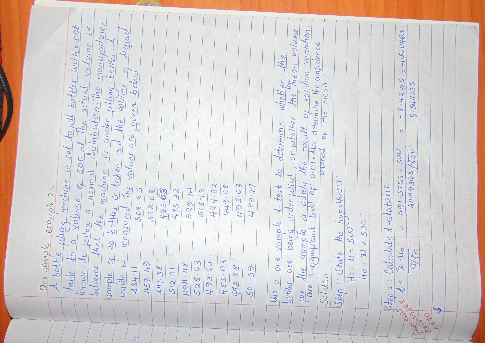

```{r setup, include=FALSE}
knitr::opts_chunk$set(echo = TRUE)
```


<center><strong><h4>Example 1</h4></strong></center>

<p style="text-align:justify;">Consider 20 first year resident female doctors drawn at random from one area, resting systolic blood pressures measured using an electronic gadget were:<br>
128, 118, 144, 133, 132, 111, 149, 139,136,126, 127,115,142, 140, 131,132,122,119,129,128.<br>
From previous large studies of women drawn at random from the healthy general public, a resting systolic blood pressure of 120mm was predicted as the population mean, for the relevant age group. Test to see whether there is a difference between the means at 95% level of significance.</p> <br><br>

<h5>Calculations by hand</h5>
```{r ,comment=NA}

knitr::include_graphics("DSC06212_2.jpg")
```


<h5>Execution in R</h5>

```{r}
## load the library required to intergrate R and Python
library(reticulate)
```

```{python,comment=NA}

## Load the python libraries
from scipy.stats import ttest_1samp #used for carrying out one sample t-tests

```

```{r ,comment=NA}

## Generate a vector of values
vals <- c(128, 118, 144, 133, 132, 111, 149, 139,136,126, 127,115,142, 140, 131,132,122,119,129,128)

## Carry out the t-test to determine whether the population mean is significantly different from 120
t.test(vals, mu=120,alternative = "two.sided")


```


<h5>Execution in Python</h5>
```{python,comment=NA}

## Generate a vector of values
vals_py = [128, 118, 144, 133, 132, 111, 149, 139,136,126, 127,115,142, 140, 131,132,122,119,129,128]

## Carry out the t-test to determine whether the population mean is significantly different from 120
ttest_1samp(vals_py, 120)


```

<center><strong><h4>Example 2</h4></strong></center>

<h5>Calculations by hand</h5>
```{r ,comment=NA}


knitr::include_graphics("DSC06214.JPG")
```

<h5>Execution in R</h5>
```{r ,comment=NA}

## Generate a vector of values
volume <- c(484.11,459.49,471.38,512.01,494.48,528.63,493.64,485.03,473.88,
            501.59,502.85,538.08,465.68,495.03,475.32,529.41,518.13,464.32,449.08,489.27)

## Carry out the t-test
t.test(volume, alternative = "less", mu=500,conf.level = 0.99)


```

<h5>Execution in Python</h5>
```{python,comment=NA}
## Generate a vector of values
volume = [484.11,459.49,471.38,512.01,494.48,528.63,493.64,485.03,473.88,
            501.59,502.85,538.08,465.68,495.03,475.32,529.41,518.13,464.32,449.08,489.27]

## Carry out the t-test 
ttest_1samp(volume, 500)


##Notes:
## The p-value obtained is that of a two tailed test, so we divide it by 2 to get the p-value of a one tailed test (0.14486225283259022/2 = 0.07243113)
```


 
